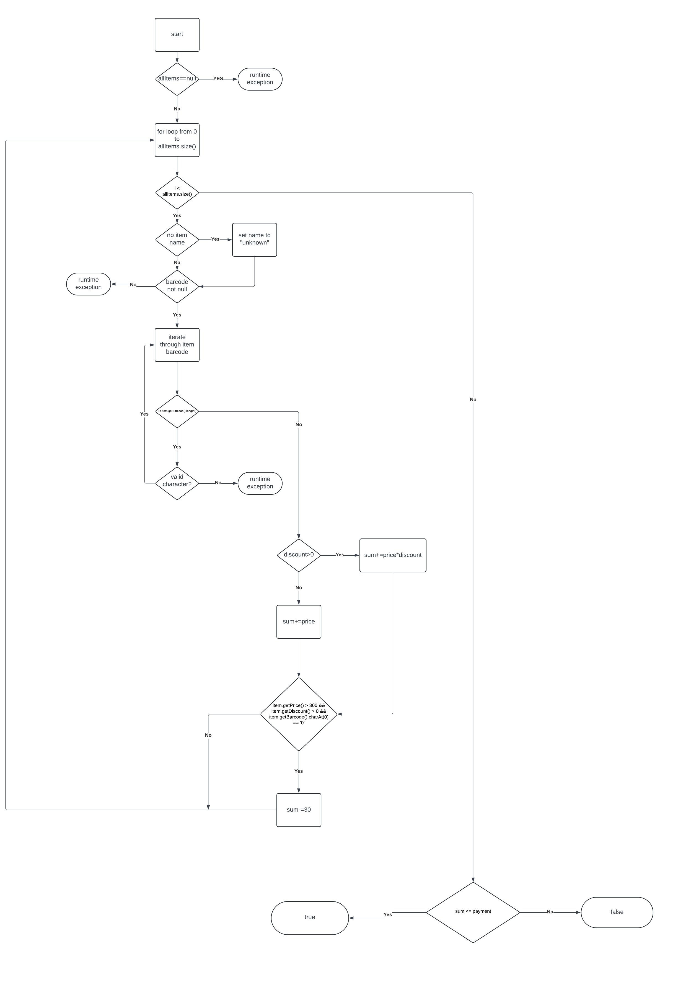

Jana Hristova 226004

Цикломатската комплексност се пресметува со следнава формула:
E(рабови) - V(темиња) + 2P(региони)
Користејќи ја оваа формула се добива дека цикломаската комплексност е 6,
што значи дека постојат 6 линеарно независни патишта.

Тест случаи според Every Branch критериумот:

1. null allItems листа
Input: allItems = null, payment = 300
Output: RuntimeException("allItmes list can't be null")

2. Продукт без име
Input: allItems = [new Item("", "234", 250, 0.3)], payment = 100
Output: true
Името на продуктот ќе биде поставено на unknown

3. Продукт без баркод
Input: allItems = [new Item("Item", null, 200, 0)], payment = 100
Output: RuntimeException("No barcode!")

4. Продукт со невалиден баркод
Input: allItems = [new Item("Item", "89ab", 200, 0)], payment = 200
Output: RuntimeException("Invalid character in item barcode!")

5. Продукт со попуст што не го задоволува условот item.getPrice() > 300 && item.getDiscount() > 0 && item.getBarcode().charAt(0) == '0'
Input: allItems = [new Item("item", "123", 100, 0.7)], payment=100
Output: true

6. Продукт со попуст што го задоволува условот item.getPrice() > 300 && item.getDiscount() > 0 && item.getBarcode().charAt(0) == '0'
Input: allItems = [new Item("item", "0123", 500, 0.7)], payment = 100
Output: false

7. Продукт без попуст
Input: allItems = [new Item("item", "0123", 500, 0)], payment = 100
Output: false

8. Вкупна цена не надминува уплата
Input: allItems = [new Item("Item1", "123", 400, 0), new Item("Item2", "456", 200, 0.3)], payment = 800
Output: true

9. Вкупна цена надминува уплата
Input: allItems = [new Item("Item1", "789", 1000, 0), new Item("Item2", "012", 700, 0.8)], payment = 1200
Output: false

Тест случаи според Multiple Condition критериумот:

1. Input: allItems = [new Item("Item", "123", 400, 0)], payment = 100
Outcome: no change in sum
Првиот услов е исполнет, другите два не.

2.  Input: allItems = [new Item("Item", "123", 200, 0.5)], payment = 100
Outcome: no change in sum
Вториот услов е исполнет, другите два не.

3.  Input: allItems = [new Item("Item", "0123", 200, 0)], payment = 100
Outcome: no change in sum
Третиот услов е исполнет, другите два не.

4.  Input: allItems = [new Item("Item", "123", 400, 0.5)], payment = 100
Outcome: no change in sum
Првите два услови се исполнети, а третиот не.

5.  Input: allItems = [new Item("Item", "0123", 400, 0)], payment = 100
Outcome: no change in sum
Првиот и третиот услов се исполнети, вториот не.

6.  Input: allItems = [new Item("Item", "0123", 200, 0.5)], payment = 100
Outcome: no change in sum
Вториот и третиот услов се исполнети, а првиот не.

7.  Input: allItems = [new Item("Item", "123", 200, 0)], payment = 100
Outcome: no change in sum
Ниеден од условите не е исполнет.

8.  Input: allItems = [new Item("Item", "0123", 400, 0.5)], payment = 100
Outcome: sum-=30
Сите услови се исполнети.
